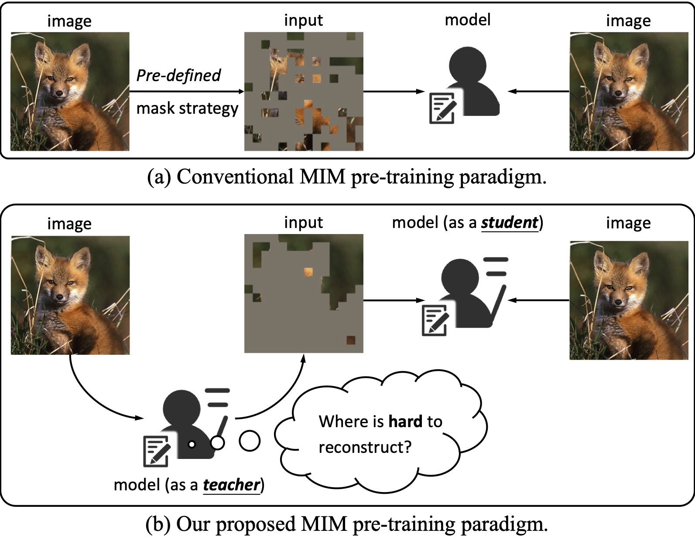
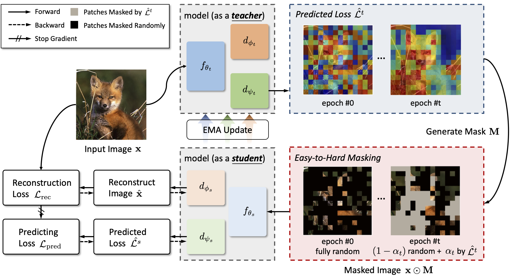

# Hard Patches Mining for Masked Image Modeling
Official Implementation of our paper "**Hard Patches Mining for Masked Image Modeling**", in **CVPR 2023**. 

by 
<a href="https://scholar.google.com/citations?user=oNlpTdcAAAAJ&hl=zh-CN" target="_blank">Haochen Wang</a>,
<a href="https://scholar.google.com/citations?user=VLqzM1wAAAAJ&hl=zh-CN" target="_blank">Kaiyou Song</a>,
<a href="https://scholar.google.com/citations?hl=zh-CN&user=AfK4UcUAAAAJ" target="_blank">Junsong Fan</a>,
<a href="https://scholar.google.com/citations?hl=zh-CN&user=waLCodcAAAAJ" target="_blank">Yuxi Wang</a>,
<a href="https://openreview.net/profile?id=~Jin_Xie9" target="_blank">Jin Xie</a>, and
<a href="https://scholar.google.com/citations?user=qxWfV6cAAAAJ" target="_blank">Zhaoxiang Zhang</a>

**[[arXiv]](https://arxiv.org/abs/2304.05919)**  **[[Paper]](https://arxiv.org/pdf/2304.05919.pdf)**

## Notes

* This repo is a modification on the [MAE repo](https://github.com/facebookresearch/mae). Installation and preparation follow that repo.

* This repo is based on [`timm==0.3.2`](https://github.com/rwightman/pytorch-image-models), for which a [fix](https://github.com/rwightman/pytorch-image-models/issues/420#issuecomment-776459842) is needed to work with PyTorch 1.8.1+.

* This repo is the official implementation of [Hard Patches Mining for Masked Image Modeling](https://arxiv.org/pdf/2304.05919.pdf). It includes codes and models for the following tasks:
> **ImageNet-1K Pretrain**: See [PRETRAIN.md](PRETRAIN.md).\
> **ImageNet-1L Finetune**: See [FINETUNE.md](FINETUNE.md).

## Motivation
**Abstract.**
Masked image modeling (MIM) has attracted much research attention due to its promising potential for learning scalable visual representations.
In typical approaches, models usually focus on predicting specific contents of masked patches, and their performances are highly related to pre-defined mask strategies.
Intuitively, this procedure can be considered as training a student (the model) on solving given problems (predict masked patches).
However, we argue that the model should not only focus on solving given problems, but also *stand in the shoes of a teacher* to produce a more challenging problem by itself.
To this end, we propose Hard Patches Mining (HPM), a brand-new framework for MIM pre-training.
We observe that the reconstruction loss can naturally be the metric of the difficulty of the pre-training task.
Therefore, we introduce an auxiliary loss predictor, predicting patch-wise losses first and deciding where to mask next.
It adopts a relative relationship learning strategy to prevent overfitting to exact reconstruction loss values.
Experiments under various settings demonstrate the effectiveness of HPM in constructing masked images.
Furthermore, we empirically find that solely introducing the loss prediction objective leads to powerful representations, verifying the efficacy of the ability to be aware of where is hard to reconstruct.




## Method
 


## Results
| Method | Model    | PT Epochs | Top-1 Acc.  | Checkpoint | mIoU        |
|--------|----------|-----------|-------------|------------|-------------|
| MAE    | ViT-B/16 | 200       | 82.2        |            | 40.5        |
| HPM    | ViT-B/16 | 200       | 83.0 (+0.8) |            | 42.1 (+1.6) |
| MAE    | ViT-B/16 | 1600      | 83.6        |            | 48.1        |
| HPM    | ViT-B/16 | 800       | 84.2 (+0.6) | [[Google Drive]](https://drive.google.com/file/d/1443UA5e6EvGAdnUkGd3ayMGipkRwhU4u/view?usp=sharing) | 48.5 (+0.4) |
| MAE    | ViT-L/16 | 1600      | 85.1        |            | 53.6        |
| HPM    | ViT-L/16 | 800       | 85.8 (+0.7) | [[Google Drive]](https://drive.google.com/file/d/1DLzvdUt1wO5ZEUV12AVOtWyXLUIUR85o/view?usp=sharing) | 54.6 (+1.0) |


## Acknowledgement
The pretraining and finetuning of our project are based on [DeiT](https://github.com/facebookresearch/deit), [MAE](https://github.com/facebookresearch/mae) and [UM-MAE](https://github.com/implus/UM-MAE). 
The linear probing is based on [MAE](https://github.com/facebookresearch/mae).
The kNN classification is based on [DINO](https://github.com/facebookresearch/dino).
Thanks for their wonderful work.

For object detection and semantic segmentation, please refer to [Detectron2](https://github.com/facebookresearch/detectron2) and [MMSegmentation](https://github.com/open-mmlab/mmsegmentation), respectively.
The configurations can be found in [here](https://github.com/open-mmlab/mmsegmentation/tree/master/configs/mae) and [here](https://github.com/facebookresearch/detectron2/tree/main/projects/ViTDet) for detection and segmentation, respectively.


## License
This project is under the Apache License 2.0 license. See [LICENSE](LICENSE) for details.

## Citation
```bibtex
@inproceedings{wang2023hard,
  author    = {Wang, Haochen and Song, Kaiyou and Fan, Junsong and Wang, Yuxi and Xie, Jin and Zhang, Zhaoxiang},
  booktitle = {Proceedings of the IEEE/CVF Conference on Computer Vision and Pattern Recognition (CVPR)},
  title     = {Hard Patches Mining for Masked Image Modeling},
  year      = {2023},
}
```
